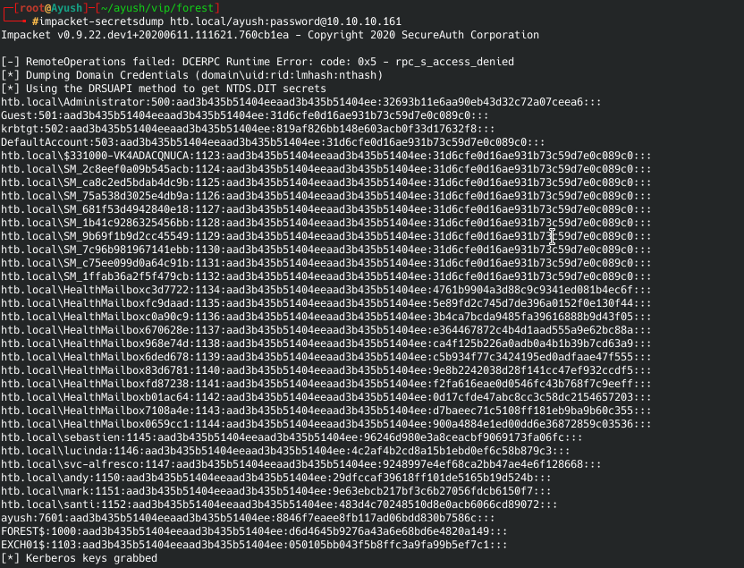
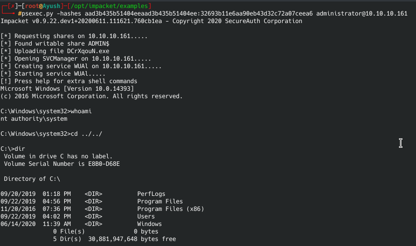

# PASS THE HASH

## What is Pass the hash?
A Pass-the-Hash (PtH) attack is a technique whereby an attacker captures a password hash (as opposed to the password characters) and then simply passes it through for authentication and potentially lateral access to other networked systems. The threat actor doesn’t need to decrypt the hash to obtain a plain text password. PtH attacks exploit the authentication protocol, as the passwords hash remains static for every session until the password is rotated. Attackers commonly obtain hashes by scraping a system’s active memory and other techniques.

While Pass-the-Hash (PtH) attacks can occur on Linux, Unix, and other platforms, they are most prevalent on Windows systems. In Windows, PtH exploits Single Sign-On (SS0) through NT Lan Manager (NTLM), Kerberos, and other authentication protocols. When a password is created in Windows, it is hashed and stored in the Security Accounts Manager (SAM), Local Security Authority Subsystem (LSASS) process memory, the Credential Manager (CredMan) store, a ntds.dit database in Active Directory, or elsewhere. So, when a user logs onto a Windows workstation or server, they essentially leave behind their password credentials.

If you’re in meterpreter shell you can run commands below

```run hashdump```

or smarthashdump like

```post/windows/gather/smart_hashdump```

Or you can search another technique in metasploit

```search hashdump```

or you can use PSEXEC module for attack
1. Get hashes within a meterpreter session
```run post/windows/gather/hashdump```

2. Now use the psexec module from metasploit
```use exploit/windows/smb/psexec```

3. Set all the required options and pass the hash with the following command
```set SMBPass [hash]``` and run the exploit.

**Example**
1. Here i have used [secretdump](https://github.com/SecureAuthCorp/impacket/blob/master/examples/secretsdump.py) to get the hashes from the target machine.


2. Now pass the hash with [psexec.py](https://github.com/SecureAuthCorp/impacket/blob/master/examples/psexec.py)
 

**Other tools that can be used for performing Pass the hash attack**
1. [Empire](https://github.com/EmpireProject/Empire)
2. [Mimikatz](https://github.com/gentilkiwi/mimikatz)
3. [Pass the hash toolkit](https://www.kali.org/tutorials/pass-the-hash-toolkit-winexe-updates/)
4. [PSExec](https://www.offensive-security.com/metasploit-unleashed/psexec-pass-hash/)
5. [Evil-winrm](https://github.com/Hackplayers/evil-winrm)
